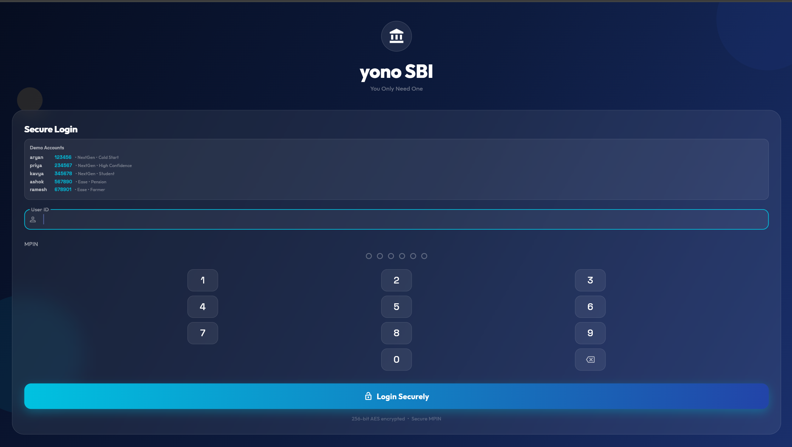
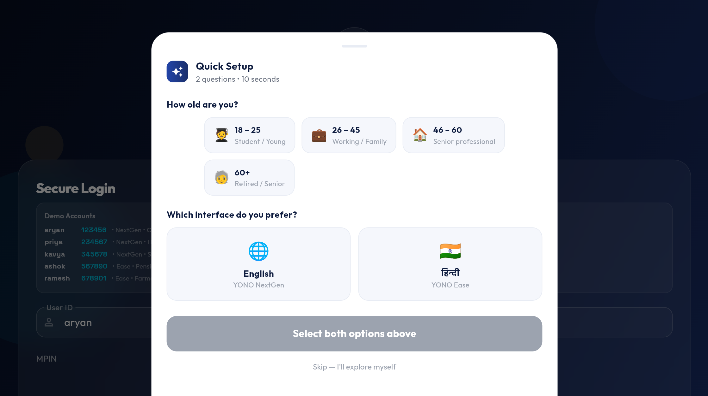
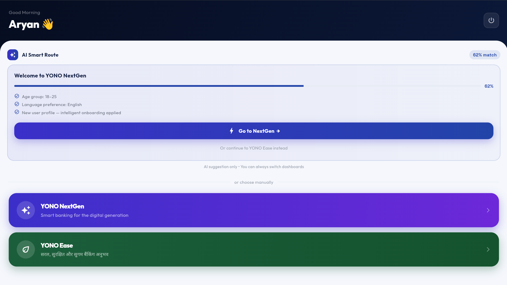
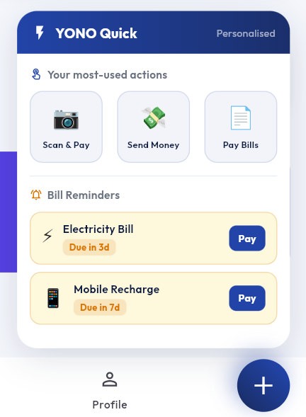
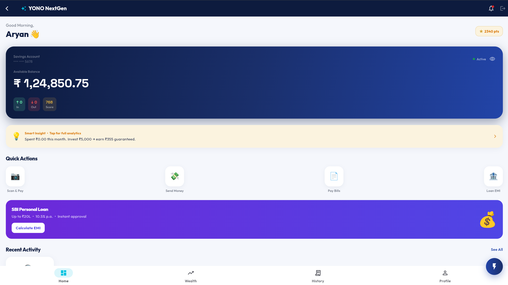
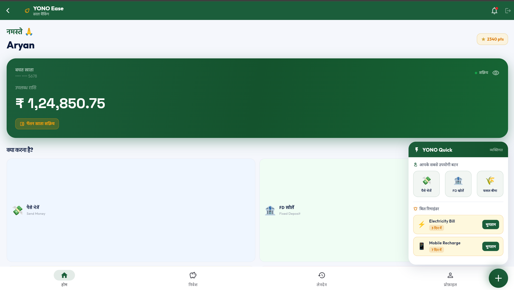
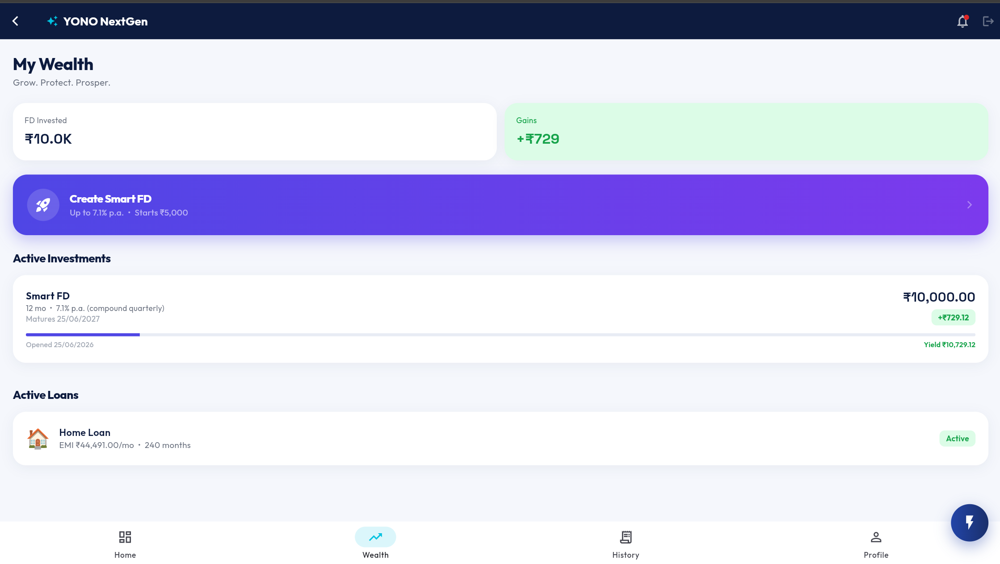
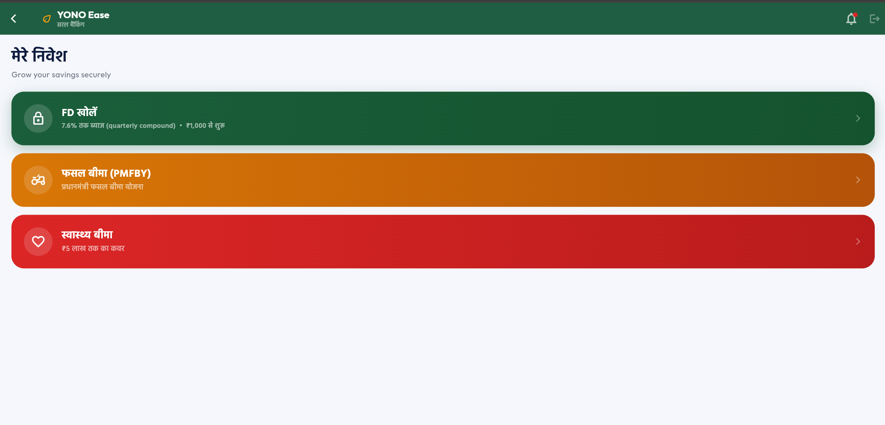

# YONO SBI — Intelligent Personalisation

**The problem:** SBI's 500M+ customers all see the exact same YONO app — whether you're a college student, a retired farmer, or a working professional. No personalisation. No context. One interface for everyone.

**What we built:** An ML pipeline that reads a user's transaction history at login and automatically routes them to a dashboard built for their life — right language, right features, right layout.

[⬇ Download APK](https://github.com/Aryan45-code/SBI-YONO-Personalised/releases/latest) &nbsp;·&nbsp; [🌐 Live Demo Page](https://aryan45-code.github.io/SBI-YONO-Personalised/)

---

## Two dashboards. One intelligent switch.

| | 🚀 YONO NextGen | 🙏 YONO Ease |
|---|---|---|
| **For** | Youth, urban, digital-first users | Senior citizens, rural, Hindi-first users |
| **Language** | English | हिंदी |
| **Features** | Scan & Pay, UPI, Loan EMI, Smart FD, Analytics | पैसे भेजें, FD खोलें, फसल बीमा, स्वास्थ्य बीमा |

The ML model scores 9 signals from transaction data — `pension_signal` (weight ×3.5), `digital_ratio` (×2.8), `utility_ratio` (×2.4) and more — to predict which dashboard fits the user. Confidence ≥68% routes automatically. New users with no history get a 2-question setup instead.

---

## Screenshots

<table>
<tr>
<td align="center" width="25%">
 
<b>Login + MPIN</b>
</td>
<td align="center" width="25%">
 
<b>Cold Start Survey</b>
</td>
<td align="center" width="25%">
 
<b>AI Smart Route</b>
</td>
<td align="center" width="25%">
 
<b>YONO Quick</b>
</td>
</tr>
<tr>
<td align="center" width="25%">
 
<b>NextGen Home</b>
</td>
<td align="center" width="25%">
 
<b>Ease Home — हिंदी</b>
</td>
<td align="center" width="25%">
 
<b>NextGen Wealth</b>
</td>
<td align="center" width="25%">
 
<b>Ease — मेरे निवेश</b>
</td>
</tr>
</table>

---

## Try it — demo credentials

| Username | PIN | Routes to | Why |
|----------|-----|-----------|-----|
| `aryan` | `123456` | NextGen (cold start) | No transaction history |
| `priya` | `234567` | NextGen | High digital + food spend |
| `kavya` | `345678` | NextGen (cold start) | Student, minimal transactions |
| `ashok` | `567890` | Ease | Pension income detected |
| `ramesh` | `678901` | Ease | Farmer profile, Hindi patterns |

> 💡 On the portal screen, double-tap your name to inject demo transactions and see the ML score live.

---

## Tech stack

Flutter · Riverpod · GoRouter · On-device ML (9-feature weighted scorer, <600ms) · flutter_secure_storage (AES-GCM) · Integer paise arithmetic · UUID v4

---

## Team

| Name | Role | College |
|------|------|---------|
|Aryan Pandey |Full Stack Developer · ML Pipeline · UI/UX|Manipal University Jaipur
|Suraj Sharma |Research & Testing                        |Manipal University Jaipur

SBI Global Fintech Fest 2026 · Customer Experience & AI Track · Prototype, not affiliated with State Bank of India

